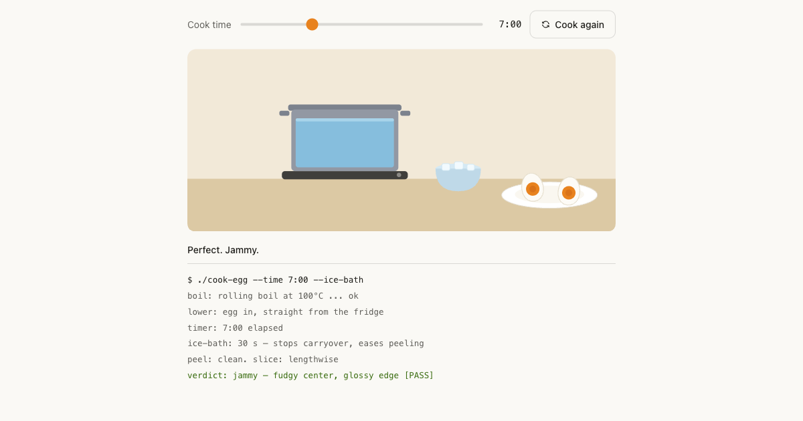

# The perfect egg 🍳

An interactive simulator of the most reproducible recipe in breakfast: the **7-minute jammy egg**.

Pick a cook time from 5:00 to 12:00, press cook, and watch the whole pipeline run — rolling boil, egg lowered in straight from the fridge, timer, ice bath, peel, slice. Then inspect the yolk: runny at 6:00, jammy and fudgy at 7:00, chalky with a gray-green sulfur ring if you forget about it past 11:00.



## Why 7:00

| Time | Result |
| --- | --- |
| 6:00 | Fully runny yolk — dippy-egg territory |
| 7:00 | Jammy, fudgy center — the one |
| 8:00 | Firm with a soft heart — egg-salad grade |
| 9:30 | Hard-boiled, still creamy |
| 11:00+ | Chalky yolk, gray-green ring — overcooked |

Boiling from a rolling start with a fridge-cold egg makes the timing exact rather than vibes-based. Set a timer and you get the identical egg every single run. The timer **is** the recipe.

## Tech

- A single static `index.html` — no framework, no build step, zero dependencies
- Vanilla JS + inline SVG for the kitchen scene and yolk cross-sections
- Yolk color is interpolated continuously across doneness keyframes
- Dark mode via `prefers-color-scheme`, reduced motion via `prefers-reduced-motion`
- Simulation runs at 75× real time (a 7:00 egg takes ~5.6 s)

## Run locally

Open `index.html` in a browser. That's it. Or, if you prefer a server:

```sh
npx serve .
```

## Deploy

Deployed on [Vercel](https://vercel.com) as a static site — no configuration needed.

## License

[MIT](LICENSE)
